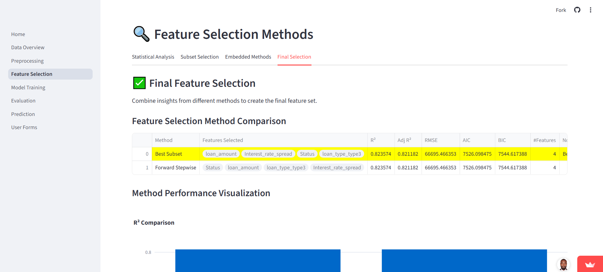

# Interactive Loan Default Prediction Web App Using Streamlit  
*Empowering Financial Decision-Making at FinServe Bank with Machine Learning*

---

## ⚠️ Disclaimer
This project uses **synthetic or anonymized datasets** for demonstration purposes. No confidential customer data is included. It highlights the ability to build predictive analytics applications while maintaining ethical and privacy standards.

---

## Introduction
**FinServe Bank** wants to reduce financial risk by identifying customers who may default on loans. This **Interactive Loan Default Prediction Web App** simulates a real-world scenario, allowing the bank’s analysts to:  

- Analyze customer financial and demographic data  
- Preprocess data for machine learning  
- Train and evaluate regression models  
- Make interactive predictions for individual clients  

The app demonstrates how machine learning can improve **loan approval decisions**, minimize defaults, and optimize lending strategies.  

---

## Table of Contents
- [Description](#description)  
- [Methodology](#methodology)  
- [Tools and Technologies](#tools-and-technologies)  
- [Deployment](#deployment)  
- [Project Screenshots](#project-screenshots)  
- [Conclusions & Recommendations](#conclusions--recommendations)  
- [Future Enhancements](#future-enhancements)  
- [Contact](#contact)  
- [Thank You](#thank-you)  

---

## Description
This project demonstrates a full **machine learning workflow for loan default prediction**, including:  
- Importing and exploring datasets  
- Preprocessing (handling missing values, encoding, scaling)  
- Feature selection (best subset, forward stepwise)  
- Model training and evaluation  
- Interactive prediction for custom user input  

  
---  
  
---  
  

---

## Methodology

### 1. Data Import and Overview
- Users can upload a CSV or load the provided Kaggle dataset.  
- Summary statistics and visualizations are generated to explore trends, distributions, and missing data.

### 2. Data Preprocessing
- Handle missing values  
- Encode categorical variables  
- Normalize or standardize numerical variables  

  
---  
  
---  
  
---  
  

### 3. Feature Selection
- **Best Subset Selection** and **Forward Stepwise Selection** are implemented.  
- Outputs are compared to select the most predictive features.

  

### 4. Model Training & Evaluation
- Train regression models using selected features  
- Evaluate using **RMSE** and **R² metrics**  
- Visualize predicted vs actual loan default amounts  

  

### 5. Interactive Prediction
- Users input **custom feature values** to predict loan default amount  
- Display predicted value dynamically  

  
---  
  
---  
  

---

## Tools and Technologies
| Tool/Library | Purpose |
|--------------|---------|
| Python | Core scripting and ML models |
| Streamlit | Frontend web app and UI |
| Scikit-learn | ML model training and evaluation |
| Pandas / NumPy | Data manipulation and preprocessing |
| Matplotlib / Seaborn | Visualization |
| GitHub | Version control and repository hosting |

---

## Deployment
The app is deployed on **Streamlit Community Cloud**:  
[Click here to access the live app](https://loan-appp.streamlit.app/)  

---

## Project Screenshots
- **Landing Page / Home Screen**  
  
---  
- **Data Overview and Visualization**  
  
---  
- **Preprocessing Page**  
  
---  
- **Feature Selection**  
  
---  
- **Prediction Page**  
  

---

## Conclusions & Recommendations
- The app demonstrates a complete **machine learning workflow**, providing reliable predictions of loan default amounts.  
- Key predictive features were identified using **Best Subset** and **Forward Stepwise Selection**, with strong evaluation metrics (RMSE, R²).  
- **Recommendations:** deploy in real-world lending platforms, retrain models regularly, enhance feature engineering, provide explanations for predictions, and scale the app for large datasets.  

---

## Future Enhancements
- Add **automated feature engineering** to improve model accuracy  
- Include **classification models** for default risk categories  
- Enable **multi-user support** with login and personalized predictions  
- Expand **visualizations and dashboard insights** for better interpretability  

---

## Contact
For questions or collaborations, feel free to reach out!  

  

---

## Thank You

