# Interactive Loan Default Prediction Web App Using Streamlit
*Leveraging Machine Learning to Predict Loan Default Amounts for Better Financial Decision-Making*

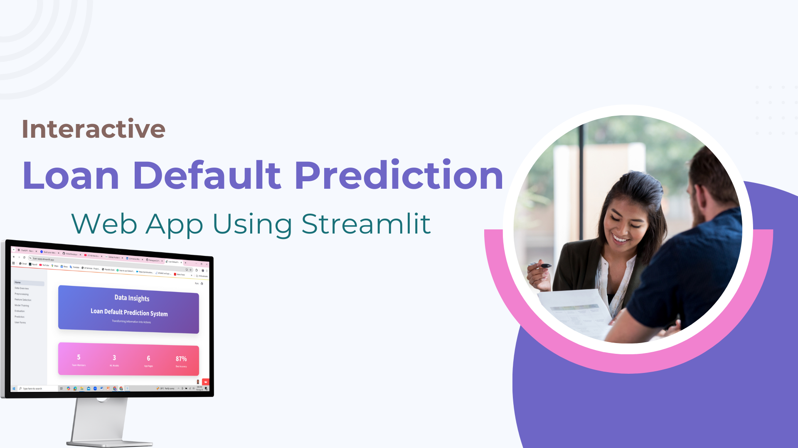

---

## ⚠️ Disclaimer
This project uses **synthetic or anonymized data** for demonstration purposes. No confidential or real customer information is included. It showcases skills in building predictive analytics web apps while following ethical and privacy standards.

---

## Introduction
The Loan Default Prediction Web App is a multi-page interactive application built with Streamlit. It allows users to **analyze datasets, preprocess data, train regression models, evaluate performance, and make custom predictions**. The app simulates real-world financial risk modeling and supports decision-making for banking and loan management.

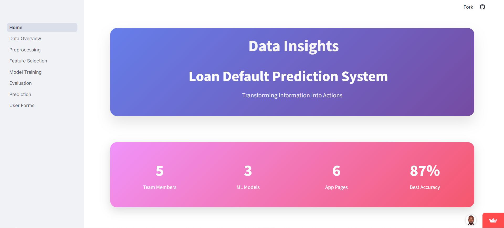

---

## Table of Contents
- [Description](#description)
- [Methodology](#methodology)
- [Tools and Technologies](#tools-and-technologies)
- [Deployment](#deployment)
- [Project Screenshots](#project-screenshots)
- [Future Enhancements](#future-enhancements)
- [Contact](#contact)

---

## Description
This project demonstrates a full **machine learning workflow for loan default prediction**, including:  
- Importing and exploring datasets  
- Preprocessing (handling missing values, encoding, scaling)  
- Feature selection (best subset, forward stepwise)  
- Model training and evaluation  
- Interactive prediction for custom user input  

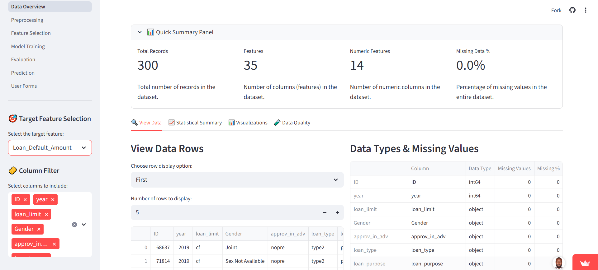  
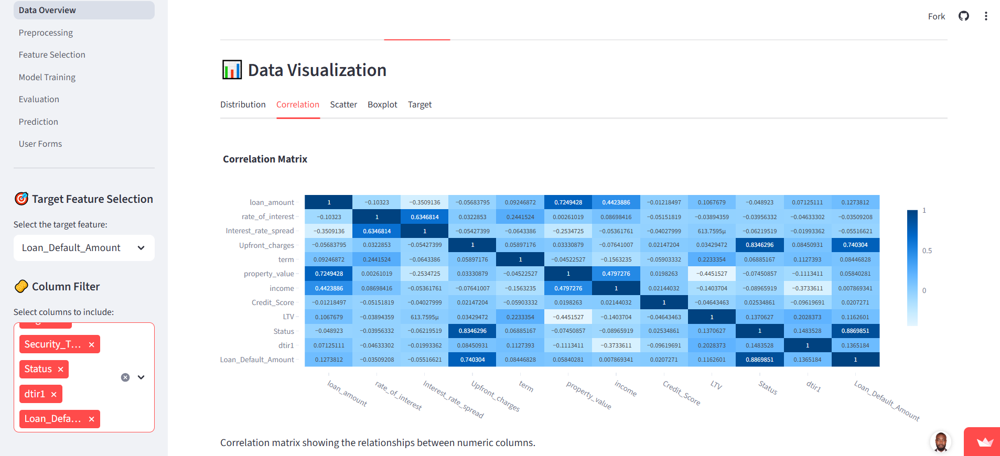
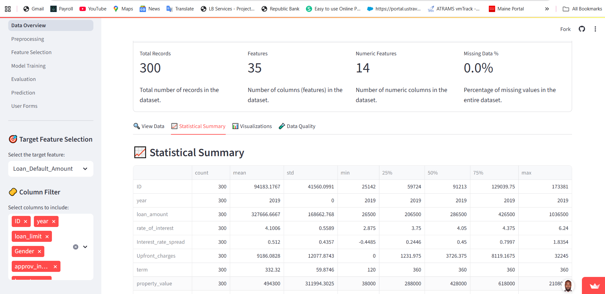.

---

## Methodology

### 1. Data Import and Overview
- Users can upload a CSV or load the provided Kaggle dataset.  
- Summary statistics and visualizations are generated.

### 2. Data Preprocessing
- Handle missing values  
- Encode categorical variables  
- Normalize/standardize numerical variables  

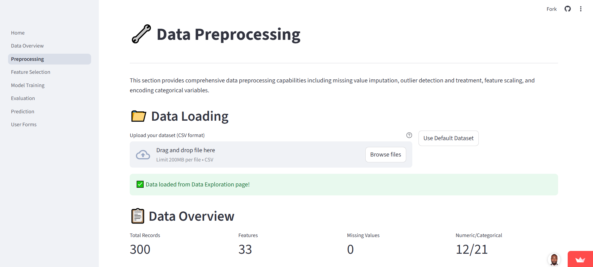
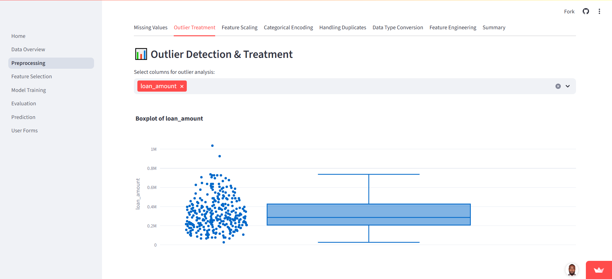
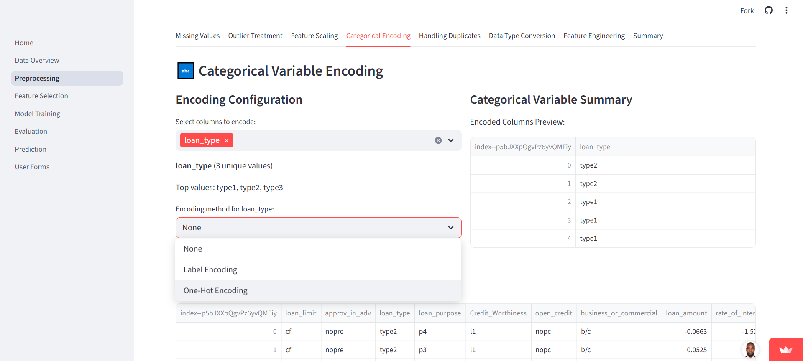
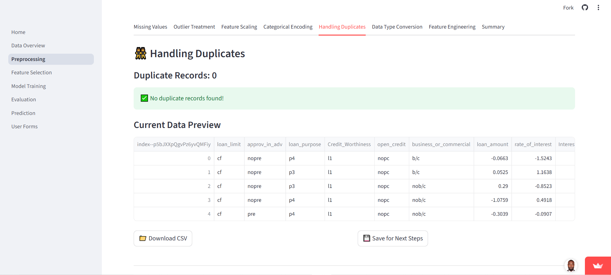

### 3. Feature Selection
- **Best Subset Selection** and **Forward Stepwise Selection** are implemented.  
- Outputs are compared to select optimal predictive features.

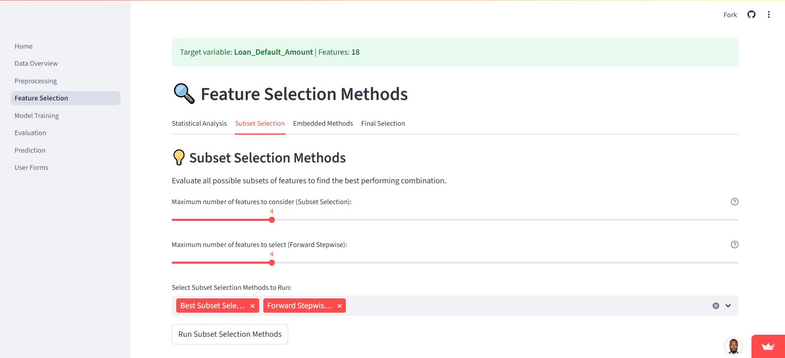

### 4. Model Training & Evaluation
- Train regression models using selected features  
- Evaluate using **RMSE** and **R²**  
- Visualize predicted vs actual values

### 5. Interactive Prediction
- Users input custom feature values to predict loan default amount  
- Display predicted value dynamically

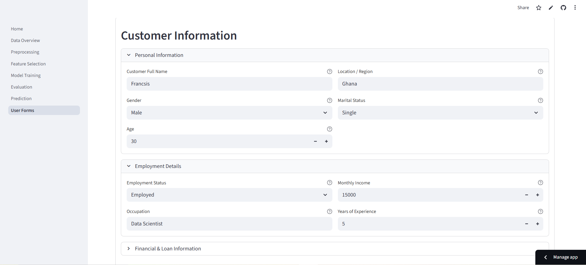

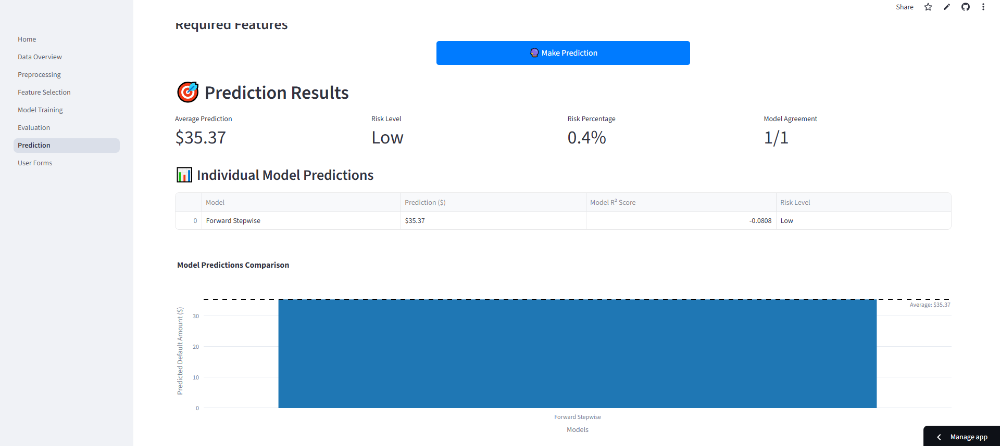

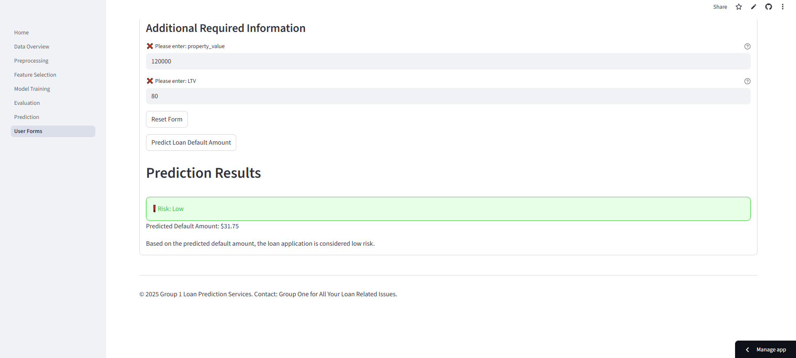

---

## Tools and Technologies
| Tool/Library | Purpose |
|--------------|---------|
| Python | Core scripting and ML models |
| Streamlit | Frontend web app and UI |
| Scikit-learn | ML model training and evaluation |
| Pandas / NumPy | Data manipulation and preprocessing |
| Matplotlib / Seaborn | Visualization |
| GitHub | Version control and repository hosting |

---

## Deployment
The app is deployed on **Streamlit Community Cloud**:  
[Click here to access the live app](https://loan-appp.streamlit.app/)  

---

## Project Screenshots
- **Landing Page / Home Screen**  
  

- **Data Overview and Visualization**  
  

- **Preprocessing Page**  
  

- **Feature Selection**  
  

- **Prediction Page**  
  

---

## Conclusions & Recommendations
- The app demonstrates a complete **machine learning workflow**, providing reliable predictions of loan default amounts.  
- Key predictive features were identified using **Best Subset** and **Forward Stepwise Selection**, with strong evaluation metrics (RMSE, R²).  
- **Recommendations:** deploy in real-world lending platforms, retrain models regularly, enhance feature engineering, provide explanation for predictions, and scale the app for large datasets.  

---

## Future Enhancements
- Add **automated feature engineering** to improve model accuracy  
- Include **classification models** for default risk categories  
- Enable **multi-user support** with login and personalized predictions  
- Expand **visualizations and dashboard insights** for better interpretability  

---

## Contact
For questions or collaborations, feel free to reach out!  

  

